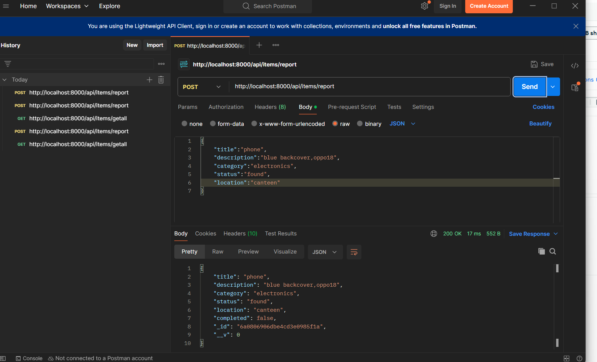
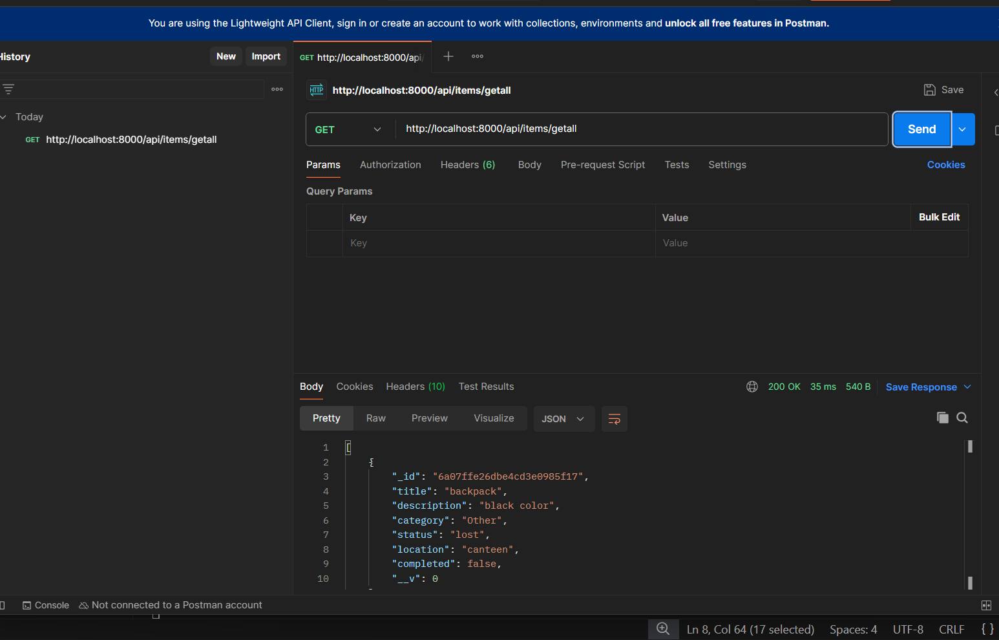
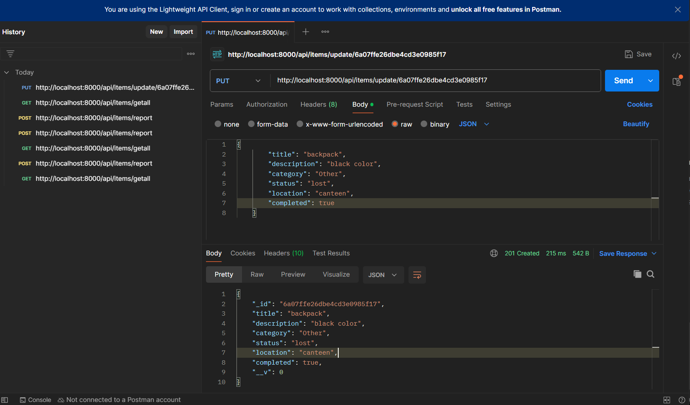
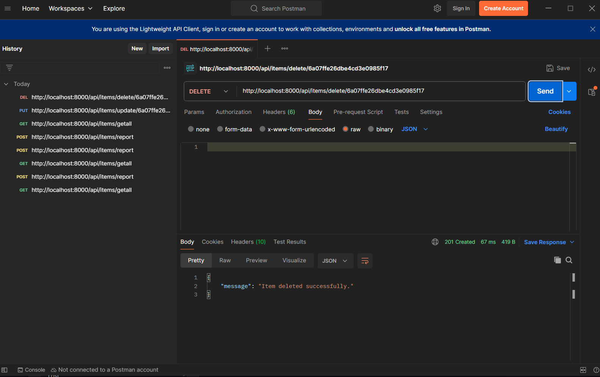
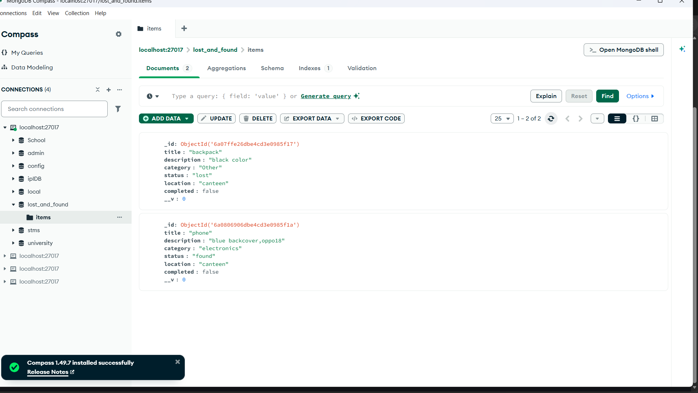
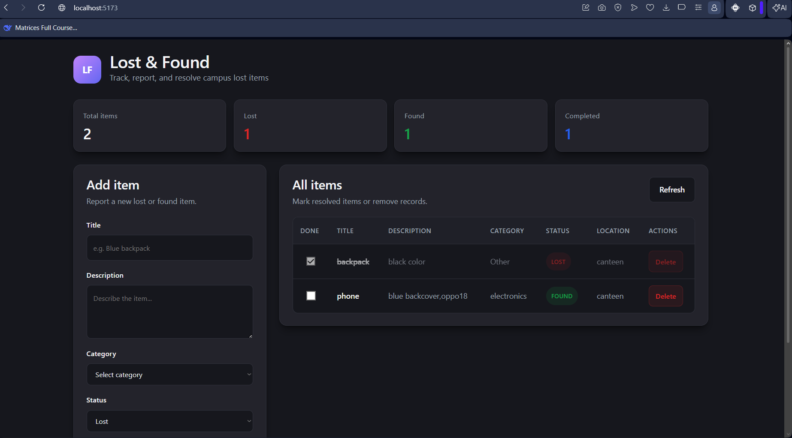
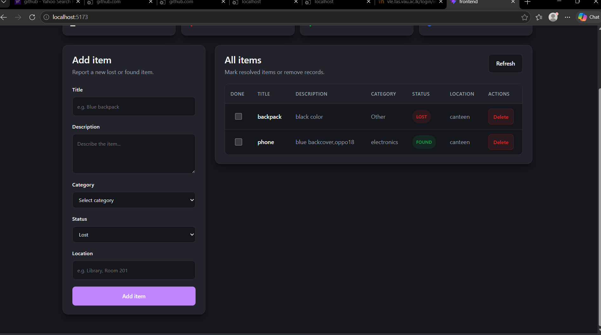

# University Campus Lost & Found System

**Course:** Web Services and Technology (IT2234)  
**Project Type:** Full-Stack Web Application (REST API + Optional React Frontend)

---

## 1. Problem Description

University campuses are busy environments where students and staff frequently misplace personal belongings—laptops, ID cards, keys, wallets, phones, and clothing. When an item is lost, the owner often has no reliable way to know whether someone else has found it or where to look next.

Traditional recovery methods create significant friction:

- **Physical notice boards** are limited to one location, become outdated quickly, and offer no search or filtering.
- **Social media groups** scatter information across posts and comments, are hard to moderate, and lack structured data (category, location, status).
- **Word of mouth** is slow and depends on the right people seeing the right message at the right time.

These approaches are inefficient, unorganized, and do not scale for a large campus population. There is a clear need for a centralized, accessible, and structured digital platform.

---

## 2. Proposed Solution

This project delivers a **digital Lost & Found System**—a centralized web application that allows students and staff to report, browse, update, and remove lost or found item records through a RESTful API backed by MongoDB.

The system provides:

- A **single source of truth** for all reported items on campus
- **Structured records** (title, description, category, status, location, completion flag)
- **Fast retrieval** of all entries for dashboards or public listings
- **Status tracking** so items can move from *lost* → *found* → *claimed/completed*
- An **optional React.js frontend** for a modern, user-friendly interface (developed with Cursor IDE / Vibe Coding)

By replacing fragmented notices with a database-driven API, the platform improves visibility, accountability, and the chance of reuniting owners with their belongings.

---

## 3. Features

| Feature | Description |
|--------|-------------|
| **Report items (Create)** | Submit a new lost or found item with details and location |
| **View all items (Read)** | Retrieve every reported entry from the database |
| **Update status (Update)** | Modify item fields (e.g., mark as found, set `completed` to `true`) |
| **Delete claimed entries (Delete)** | Remove records once an item has been returned to its owner |

Additional capabilities include categorization (Electronics, Clothing, Keys, etc.), filtering by status (`lost` / `found`), and a completion flag to distinguish active vs. resolved cases.

---

## 4. Technologies Used

| Technology | Role |
|------------|------|
| **Node.js** | JavaScript runtime for the backend server |
| **Express.js** | Web framework for routing and HTTP handling |
| **MongoDB** | NoSQL database for persistent item storage |
| **Mongoose** | ODM for schema definition and MongoDB interaction |
| **Postman** | API testing and documentation during development |
| **GitHub** | Version control and project collaboration |
| **React.js** | Optional frontend UI (Vite + React) |
| **Cursor IDE** | Development environment (Vibe Coding for frontend) |

---

## 5. API Endpoints (with Examples)

**Base URL:** `http://localhost:8000`

All item routes are prefixed with `/api/items`.

### Item Schema (Request Body Fields)

| Field | Type | Required | Description |
|-------|------|----------|-------------|
| `title` | String | Yes | Short name of the item |
| `description` | String | Yes | Detailed description |
| `category` | String | Yes | e.g., Electronics, Keys, Documents |
| `status` | String | Yes | `"lost"` or `"found"` |
| `location` | String | Yes | Where the item was lost or found |
| `completed` | Boolean | No | Default `false`; set `true` when claimed |

---

### POST — Report a New Item


**Endpoint:** `POST http://localhost:8000/api/items/report`

**Request body (JSON):**

```json
{
  "title": "Black Lenovo Laptop",
  "description": "15-inch laptop in a gray sleeve. Sticker on the lid.",
  "category": "Electronics",
  "status": "lost",
  "location": "Library Building, 2nd Floor",
  "completed": false
}
```

**Success response (200):**

```json
{
  "_id": "674a1b2c3d4e5f6789012345",
  "title": "Black Lenovo Laptop",
  "description": "15-inch laptop in a gray sleeve. Sticker on the lid.",
  "category": "Electronics",
  "status": "lost",
  "location": "Library Building, 2nd Floor",
  "completed": false,
  "__v": 0
}
```

**Error response (500):**

```json
{
  "error": "Internal Server Error."
}
```

---

### GET — Retrieve All Items


**Endpoint:** `GET http://localhost:8000/api/items/getall`

**Request body:** None

**Success response (200):**

```json
[
  {
    "_id": "674a1b2c3d4e5f6789012345",
    "title": "Black Lenovo Laptop",
    "description": "15-inch laptop in a gray sleeve.",
    "category": "Electronics",
    "status": "lost",
    "location": "Library Building, 2nd Floor",
    "completed": false,
    "__v": 0
  },
  {
    "_id": "674a1b2c3d4e5f6789012346",
    "title": "Student ID Card",
    "description": "ID card under the name Juan Dela Cruz.",
    "category": "Documents",
    "status": "found",
    "location": "Cafeteria Entrance",
    "completed": false,
    "__v": 0
  }
]
```

---

### PUT — Update an Item by ID


**Endpoint:** `PUT http://localhost:8000/api/items/update/:id`

**Example:** `PUT http://localhost:8000/api/items/update/674a1b2c3d4e5f6789012345`

**Request body (JSON):**

```json
{
  "status": "found",
  "location": "Security Office",
  "completed": true
}
```

**Success response (201):**

```json
{
  "_id": "674a1b2c3d4e5f6789012345",
  "title": "Black Lenovo Laptop",
  "description": "15-inch laptop in a gray sleeve.",
  "category": "Electronics",
  "status": "found",
  "location": "Security Office",
  "completed": true,
  "__v": 0
}
```

**Not found (404):**

```json
{
  "message": "Item not found."
}
```

---

### DELETE — Remove an Item by ID


**Endpoint:** `DELETE http://localhost:8000/api/items/delete/:id`

**Example:** `DELETE http://localhost:8000/api/items/delete/674a1b2c3d4e5f6789012345`

**Request body:** None

**Success response (201):**

```json
{
  "message": "Item deleted successfully."
}
```

**Not found (404):**

```json
{
  "message": "Item not found."
}
```

---

### Testing with Postman

1. Set the request method and URL for each endpoint above.
2. For **POST** and **PUT**, open **Body** → **raw** → **JSON** and paste the sample payloads.
3. Replace `:id` with a valid MongoDB `_id` from a prior **GET** or **POST** response.
4. Send the request and verify status codes and JSON responses.

---

## 6. Setup Instructions

### Prerequisites

- [Node.js](https://nodejs.org/) (v18 or later recommended)
- [MongoDB](https://www.mongodb.com/) running locally or a MongoDB Atlas connection string
- [Git](https://git-scm.com/)
- [Postman](https://www.postman.com/) (optional, for API testing)

### Step 1 — Clone the Repository

```bash
git clone https://github.com/<your-username>/Lost-and-Found-System.git
cd Lost-and-Found-System
```

### Step 2 — Install Backend Dependencies

From the project root:

```bash
npm install
```

### Step 3 — Configure Environment Variables

Create a `.env` file in the **project root** (same folder as `index.js`):

```env
PORT=8000
MONGO_URL=mongodb://localhost:27017/lost_and_found
```

| Variable | Description |
|----------|-------------|
| `PORT` | Port the Express server listens on (use `8000` for this project) |
| `MONGO_URL` | MongoDB connection string (local or Atlas) |

> **Note:** Ensure MongoDB is running before starting the server. For Atlas, replace `MONGO_URL` with your cluster connection string.

### Step 4 — Install Frontend Dependencies (Optional)

```bash
cd frontend
npm install
```

Create `frontend/.env`:

```env
VITE_API_URL=http://localhost:8000
```

---

## 7. How to Run the Project

### Run the Backend (Express API)

From the project root:

```bash
npm start
```

This runs the server with **nodemon** (auto-restart on file changes). You should see:

```text
Database connected successfully.
Server is running on port: 8000
```

The API is available at `http://localhost:8000`.

### Run the Frontend (React — Optional)

Open a **second terminal**, navigate to the frontend folder, and start the development server:

```bash
cd frontend
npm run dev
```

Open the URL shown in the terminal (typically `http://localhost:5173`) in your browser. The React app communicates with the backend using `VITE_API_URL`.

### Quick Verification

| Check | Command / Action |
|-------|------------------|
| API health | `GET http://localhost:8000/api/items/getall` in Postman or browser |
| Report item | `POST http://localhost:8000/api/items/report` with sample JSON |
| Frontend | Visit the Vite dev URL and submit a test item |

---

## Project Structure

```text
Lost-and-Found-System/
├── controller/          # Request handlers (CRUD logic)
├── model/               # Mongoose schemas
├── route/               # Express route definitions
├── frontend/            # React + Vite UI (optional)
├── index.js             # Server entry point
├── package.json
├── .env                 # Environment variables (not committed)
└── README.md
```

---
## Another Screenshots






## Author

M.G.D.Apsara
2022/ict/38
Lost-and-Found System

---

## License

This project was developed as an academic assignment for **IT2234 — Web Services and Technology**.
